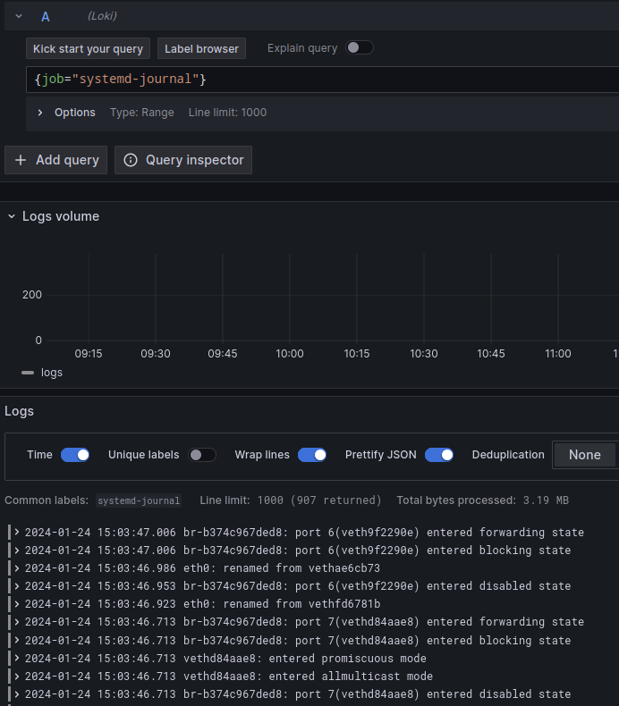
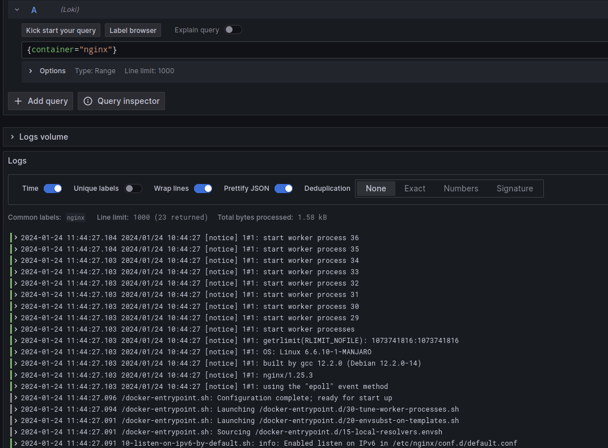

# Compte rendu Exportation de logs

Arsène Fougerouse


### 1. Monter la stack de récupération de logs

```bash 
wget https://raw.githubusercontent.com/gridexx/loki-grafana-tp/main/docker-compose.yaml -O docker-compose.yaml
docker compose up -d
```

#### Architecture


#### Configuration de Grafana

#### Configuration de Loki


#### Configuration de Promtail

Promtail est le client qui va pousser les logs dans Loki. Il faut donc lui indiquer l'adresse de Loki et le chemin vers les logs à pousser. Aussi, nous allons lui indiquer de pousser les logs dans Loki toutes les 5 secondes et d'écouter les logs du démon Docker.
Pour cela, on peut utiliser le fichier de configuration suivant :

```yaml
---
server:
  http_listen_port: 9080
  grpc_listen_port: 0

positions:
  filename: /tmp/positions.yaml

clients:
  - url: http://gateway:3100/loki/api/v1/push
    tenant_id: tenant1

scrape_configs:
  - job_name: flog_scrape 
    docker_sd_configs:
      - host: unix:///var/run/docker.sock
        refresh_interval: 5s
    relabel_configs:
      - source_labels: ['__meta_docker_container_name']
        regex: '/(.*)'
        target_label: 'container'
```

Une fois la stack deployée sur une machine distante, on peut accéder à Grafana via l'adresse IP de la machine sur le port 3100. Pour 

Pour pousser des logs dans Loki, on peut utiliser le client [promtail](https://grafana.com/docs/loki/latest/clients/promtail/). L'API de LOKI est exposée sur le port 3100 de la machine distante avec le chemin `/loki/api/v1/push`. On peut donc utiliser la commande suivante pour pousser des logs dans Loki :

```bash
curl -XPOST -H "Content-Type: application/json" -d '{"streams": [{"labels": "{job=\"promtail\"}", "entries": [{"ts": "2021-10-13T14:00:00.000Z", "line": "Hello world"}]}]}' http://<IP>:3100/loki/api/v1/push
```

### 2. Pousser des logs depuis syslog

Afin de pouvoir récupérer des logs au format standard de Syslog, nous allons ajouter de la configuration à Promtail, afin qu'il écoute en TCP sur le port 1514:

```yaml
  - job_name: syslog
    syslog:
      listen_address: 0.0.0.0:1514
      listen_protocol: tcp
      idle_timeout: 60s
      label_structured_data: yes
      labels:
        job: "syslog"
    relabel_configs:
      - source_labels: ['__syslog_message_hostname']
        target_label: 'host'
```

Redémarrer le service Promtail pour prendre en compte la nouvelle configuration.
```bash
docker-compose restart promtail
```

Maintenant, nous pouvons pousser des logs avec logger sur le port 1514 de la machine distante :

```bash
logger -n <IP> -P 1514 "Hello world"
```

Nous pouvons maintenant aller sur Grafana pour voir les logs du démon syslog:


Pour pousser des logs dans un format Syslog, 

nous allons utiliser le client [logcli](https://grafana.com/docs/loki/latest/clients/logcli/). Pour cela, nous allons utiliser le fichier de configuration suivant :


```yaml
logcli --addr http://localhost:3100 --tenant_id tenant1'{host~=".+"}'
2023-01-24T14:52:09Z {host="gridexx-latitude5420"} 2024-01-24T14:52:09.128129+01:00 gridexx-latitude5420 gridexx Hello world
```

Ici on cherche les logs qui ont un label `host` qui match avec l'expression régulière `".+"` (tous les logs qui ont un label `host`), donc ceux qui proviennent de syslog.

### 3. Pousser des logs depuis systemd

Pour pousser les logs de Systemd, il faut d'abord lier le volume dans le conteneur:
  
```yaml
  promtail:
    pictures/image: grafana/promtail:2.9.2
    volumes:
      - /var/log/journal:/var/log/journal
```

Puis, ajouter la confi

Nous pouvons ensuite récupérer les logs de Systemd via la cli

```bash
logcli --org-id="tenant1" query '{job="systemd-journal"}'
```

Ouptput:

```bash
2024/01/24 15:07:50 http://localhost:3101/loki/api/v1/query_range?direction=BACKWARD&end=1706105270639312282&limit=30&query=%7Bjob%3D%22systemd-journal%22%7D&start=1706101670639312282
2024/01/24 15:07:50 Common labels: {job="systemd-journal"}
2024-01-24T15:03:47+01:00 {} br-b374c967ded8: port 6(veth9f2290e) entered forwarding state
2024-01-24T15:03:47+01:00 {} br-b374c967ded8: port 6(veth9f2290e) entered blocking state
2024-01-24T15:03:46+01:00 {} eth0: renamed from vethae6cb73
2024-01-24T15:03:46+01:00 {} br-b374c967ded8: port 6(veth9f2290e) entere
...
```

Ou sur Grafana:




### 4. Pousser des logs avec Docker

Installer le plugin [loki-log-driver](https://grafana.com/docs/loki/latest/clients/docker-driver/)

```bash
docker plugin install grafana/loki-docker-driver:latest --alias loki --grant-all-permissions

Lancer un conteneur avec le plugin
```bash
docker run --log-driver=loki \
  --name nginx \
  --log-opt loki-url="http://localhost:3100/loki/api/v1/push" \
  --log-opt loki-retries=5 \
  --log-opt loki-batch-size=400 \
  nginx
```

Nous pouvons maintenant aller sur Grafana pour voir les logs du conteneur nginx:



#### 5. Alerting