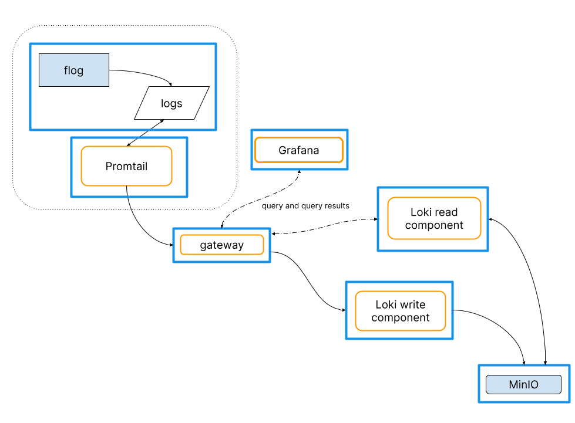
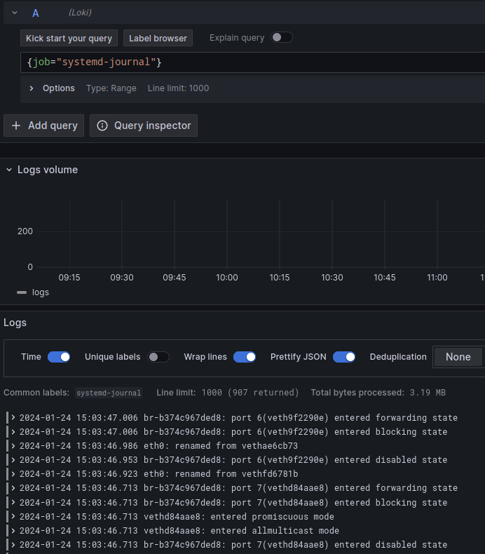
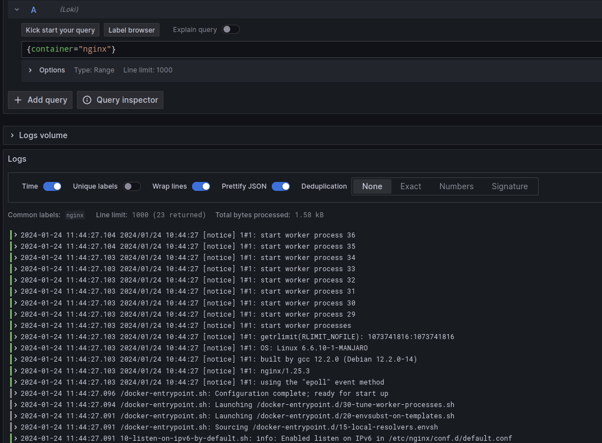

# Mise en place d'une stack de monitoring de logs

Tout le code source est disponible sur [Github](https://GridexX/loki-grafana-tp)

## 1. Monter la stack

### Architecture

J'ai choisi d'utiliser Loki et Grafana pour la récupération et la visualisation des logs. Loki est un système de gestion de logs. Grafana permet de visualiser les logs stockés dans Loki. Nous allons utiliser Docker pour déployer la stack.

Pour celà, nous utiliserons les différents services:

- 2 services Loki `read` et `write`: un pour l'indexation des logs et l'autre pour la recherche des logs
- `minio`: Le backend de stockage des logs
- `promtail`: Le client qui va pousser les logs dans Loki
- `gateway`: Le serveur nginx qui va exposer les différents services
- `flog`: Un conteneur qui va générer des logs

L'architecture suivante sera déployée:

{width=500}
  
Le `docker-compose.yaml` est disponible sur le repository Github. Pour le déployer, il suffit de lancer les commandes suivantes:

```bash
wget https://raw.githubusercontent.com/gridexx/loki-grafana-tp/main/docker-compose.yaml -O docker-compose.yaml
docker compose up -d
```

#### Configuration de Loki

Pour configurer Loki, nous allons utiliser le fichier de configuration suivant :

```yaml
server:
  http_listen_port: 3100
memberlist:
  join_members:
    - loki:7946
schema_config:
  configs:
    - from: 2021-08-01
      store: tsdb
      object_store: s3
      schema: v12
      index:
        prefix: index_
        period: 24h
common:
  path_prefix: /loki
  replication_factor: 1
  storage:
    s3:
      endpoint: minio:9000
      insecure: true
      bucketnames: loki-data
      access_key_id: loki
      secret_access_key: supersecret
      s3forcepathstyle: true
  ring:
    kvstore:
      store: memberlist
```

Nous utiliserons également Loki en mode monolithique (replica à 1). Nous configurons les journaux pour changer l'index tous les jours et nous configurons le stockage pour utiliser S3. Ici, nous utiliserons Minio.

#### Configuration de Grafana

Nous configurons Grafana pour utiliser Loki comme source de données en passant par la Gateway. Nous précisons explicitement un tenant à 1 car nous utilisons Loki en mode monolithe. Pour cela, nous allons utiliser le fichier de configuration suivant :

```yaml
apiVersion: 1
datasources:
  - name: Loki
    type: loki
    access: proxy
    url: http://gateway:3100
    jsonData:
      httpHeaderName1: "X-Scope-OrgID"
    secureJsonData:
      httpHeaderValue1: "tenant1"
```

#### Configuration de Promtail

Promtail est le client qui va pousser les logs dans Loki. Il faut donc lui indiquer l'adresse de Loki et le chemin vers les logs à pousser. Aussi, nous allons lui indiquer de pousser les logs dans Loki toutes les 5 secondes et d'écouter les logs du démon Docker.
Pour cela, on peut utiliser le fichier de configuration suivant :

```yaml
---
server:
  http_listen_port: 9080
  grpc_listen_port: 0

positions:
  filename: /tmp/positions.yaml

clients:
  - url: http://gateway:3100/loki/api/v1/push
    tenant_id: tenant1

scrape_configs:
  - job_name: flog_scrape 
    docker_sd_configs:
      - host: unix:///var/run/docker.sock
        refresh_interval: 5s
    relabel_configs:
      - source_labels: ['__meta_docker_container_name']
        regex: '/(.*)'
        target_label: 'container'
```

Une fois la stack deployée sur une machine distante, on peut accéder à Grafana via l'adresse IP de la machine sur le port 3100.

Pour pousser des logs dans Loki, on peut utiliser le client [promtail](https://grafana.com/docs/loki/latest/clients/promtail/). L'API de LOKI est exposée sur le port 3100 de la machine distante avec le chemin `/loki/api/v1/push`. On peut donc utiliser la commande suivante pour pousser des logs dans Loki :

```bash
curl -XPOST -H "Content-Type: application/json" -d '{"streams": [{"labels": "{job=\"promtail\"}", "entries": [{"ts": "2021-10-13T14:00:00.000Z", "line": "Hello world"}]}]}' http://<IP>:3100/loki/api/v1/push
```

## 2. Pousser des logs depuis syslog

Afin de pouvoir récupérer des logs au format standard de Syslog, nous allons ajouter de la configuration à Promtail, afin qu'il écoute en TCP sur le port 1514:

```yaml
  - job_name: syslog
    syslog:
      listen_address: 0.0.0.0:1514
      listen_protocol: tcp
      idle_timeout: 60s
      label_structured_data: yes
      labels:
        job: "syslog"
    relabel_configs:
      - source_labels: ['__syslog_message_hostname']
        target_label: 'host'
```

Redémarrer le service Promtail pour prendre en compte la nouvelle configuration:

```bash
docker-compose restart promtail
```

Maintenant, nous pouvons pousser des logs avec logger sur le port 1514 de la machine distante :

```bash
logger -n <IP> -P 1514 "Hello world"
```

Ici nous allons utiliser le client [logcli](https://grafana.com/docs/loki/latest/clients/logcli/) pour rechercher les logs. Pour cela, nous allons effectuer la commande suivante:

```bash
logcli --addr http://localhost:3100 --tenant_id tenant1'{host~=".+"}'
2023-01-24T14:52:09Z {host="gridexx-latitude5420"} 2024-01-24T14:52:09.128129+01:00 gridexx-latitude5420 gridexx Hello world
```

Ici on cherche les logs qui ont un label `host` qui match avec l'expression régulière `".+"` (tous les logs qui ont un label `host`), donc ceux qui proviennent de syslog.

## 3. Pousser des logs depuis systemd

Pour pousser les logs de `Systemd`, il faut d'abord lier le volume dans le conteneur:
  
```yaml
  promtail:
    image: grafana/promtail:2.9.2
    volumes:
      - /var/log/journal:/var/log/journal
```

Puis, ajouter la configuration suivante:

```yaml
- job_name: journal
  journal:
    json: false
    max_age: 62496h
    path: /var/log/journal
    matches: _TRANSPORT=kernel
    labels:
      job: systemd-journal
  relabel_configs:
    - source_labels: ['__journal__systemd_unit']
      target_label: 'unit'
```

Nous pouvons ensuite récupérer les logs de Systemd via la logcli:

```bash
logcli --org-id="tenant1" query '{job="systemd-journal"}'
```

Ouptput:

```bash
2024/01/24 15:07:50 http://localhost:3101/loki/api/v1/query_range?direction=BACKWARD&end=1706105270639312282&limit=30&query=%7Bjob%3D%22systemd-journal%22%7D&start=1706101670639312282
2024/01/24 15:07:50 Common labels: {job="systemd-journal"}
2024-01-24T15:03:47+01:00 {} br-b374c967ded8: port 6(veth9f2290e) entered forwarding state
2024-01-24T15:03:47+01:00 {} br-b374c967ded8: port 6(veth9f2290e) entered blocking state
2024-01-24T15:03:46+01:00 {} eth0: renamed from vethae6cb73
2024-01-24T15:03:46+01:00 {} br-b374c967ded8: port 6(veth9f2290e) entere
...
```

Ou sur Grafana nous obtenons le résultat suivant:



## 4. Pousser des logs avec Docker

Installer le plugin [loki-log-driver](https://grafana.com/docs/loki/latest/clients/docker-driver/)

```bash
docker plugin install grafana/loki-docker-driver:latest --alias loki --grant-all-permissions
```

Lancer un conteneur avec le plugin:

```bash
docker run --log-driver=loki \
  --name nginx \
  --log-opt loki-url="http://localhost:3100/loki/api/v1/push" \
  --log-opt loki-retries=5 \
  --log-opt loki-batch-size=400 \
  nginx
```

Nous pouvons maintenant aller sur Grafana pour voir les logs du conteneur nginx:



## 5. Alerting

Pour de l'alerting basé sur des événements. 

Le dossier `rules` contient les règles d'alerting au format YAML.
Dans notre cas, nous allons avertir si le nombre de logs de niveau `info` du conteneur loki est supérieur à 0 sur une période de 1 minutes.

```yaml
groups:
- name: test_alert
  rules:
    - alert: Loki info warning per minute rate > 0
      expr: sum(rate({container="monitoring-read-1"} | logfmt | level="info"[1m])) by (container) > 0
      for: 1m
      labels:
          severity: warning
      annotations:
          summary: Loki info warning per minute rate > 0
          message: 'Loki warning per minute rate > 0 container:"{{`{{`}} $labels.container {{`}}`}}"'
```

Puis, nous ajoutons le fichier de configuration dans les conteneurs Loki:

```yaml
    volumes:
      - ./loki-config.yaml:/etc/loki/config.yaml
      - ./rules.yaml:/etc/loki/rules.yaml:ro # Ajout du fichier de règles
```

Ensuite, il faut modifier les variables d'environnement de Alertmanager afin de prendre en compte le serveur SMTP:

Modifier le fichier `alertmanager-config.yaml` pour celà.

Ensuite ajouter le service dans le `docker-compose.yaml`:
  
```yaml
alertmanager:
  image: prom/alertmanager:v0.26.0
  command:
    - '--config.file=/etc/alertmanager/config.yml'
    - '--storage.path=/alertmanager'
  ports:
    - 9093:9093
  volumes:
    - ./alertmanager.yml:/etc/alertmanager/config.yml
    - ./data/alertmanager:/alertmanager
  networks:
    - loki
```

Enfin, relancer le docker-compose:

```bash
docker-compose up -d
```

Vérifier les règles d'alerting via Alertmanager sur localhost:9093.
